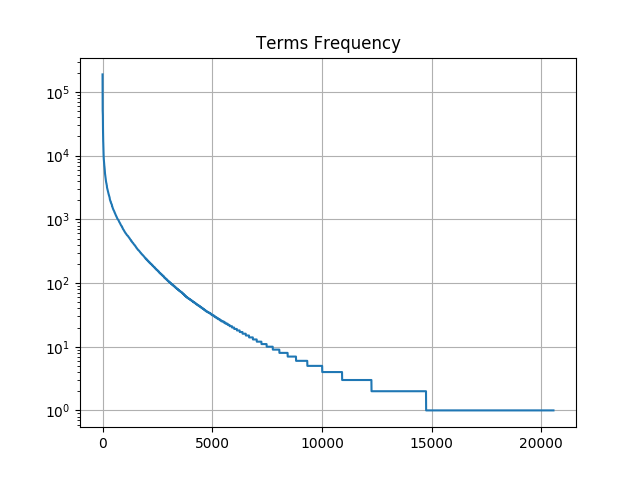

# Results


A plot in a logarithmic scale, where X-axis contains the rank of a term and Y-axis contains the number of occurrences of the term with given rank.



```
30 words with the highest ranks that do not belong to the dictionary:
margin, późn, family, text, mso, bottom, face, panose, serif, gmo, times, iv, sa, name, size, left, right, sww, skw, ex, height, line, ike, vi, indent, remediacji, vii, ure, uke, kn

30 words with 3 occurrences that do not belong to the dictionary:
adaptacyjnoopiekuńcze, agaricus, apostille, asistent, auditorów, autologicznego, aw, betaagonistycznym, betania, biorównoważności, brucellosis, cannabis, caprine, cattles, cał, cego, chemiczn, chloro, cidr, cobrpib, condensed, control, cych, cyjanamidowy, cza, daninowym, deklarow, dimocznika, div, dnego

The most probable correction of the words from the previous list:
adaptacyjny, awaria, postulat, asystent, audytor, autonomiczny, aż, agonistyczny, brytania, równoważność, bruceloza, napis, curie, seattle, cały, czego, chemiczny, chlor, cydr, obręb, kontener, kontrola, cech, wyznaniowy, za, dniowy, deklarować, mocznik, hiv, długo
```
