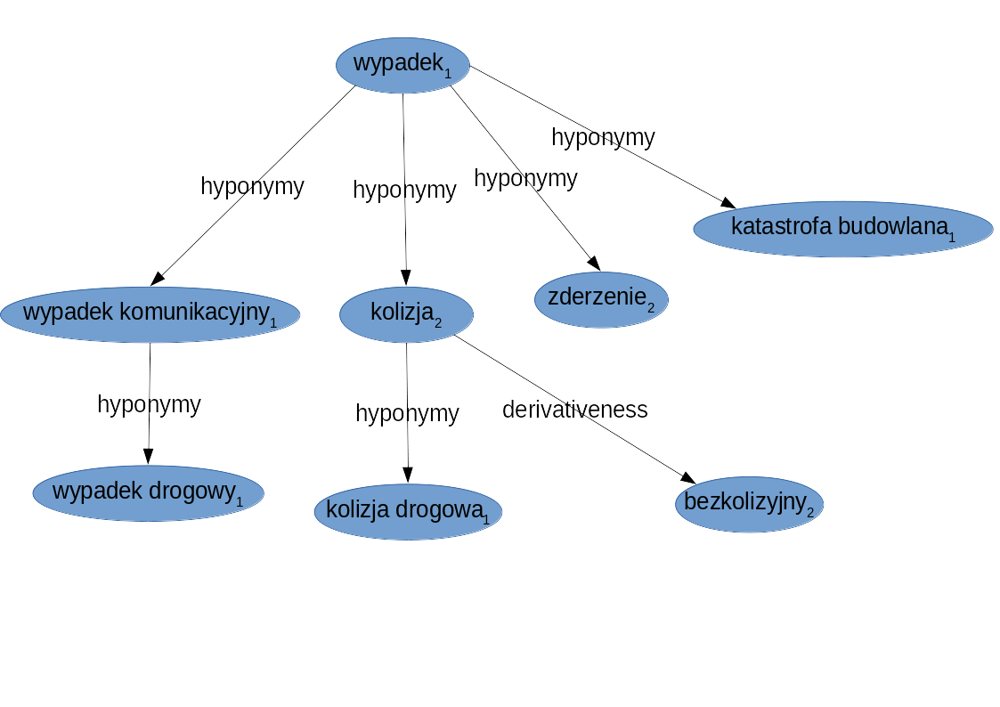

# Answers

* Find all meanings of the *szkoda* **noun** and display all their synonyms. [Found on `http://plwordnet.pwr.wroc.pl/` website]
    * miejsce w polu lub ogrodzie, gdzie zwierzęta (np. drób, bydło) zniszczyły plony
    * mimowolna utrata czegoś, szkoda
        * strata 1
        * utrata 1
        * uszczerbek 1

* Find closure of **hypernymy** relation for the first meaning of the *wypadek drogowy* expression. Create diagram of the relations as a directed graph.

    Diagram generated with `http://plwordnet.pwr.wroc.pl/` website
    

* Find direct **hyponyms** of _wypadek1_ noun.

    Diagram created with [WordNetLoom-Viewer](http://ws.clarin-pl.eu/public/WordnetLoom-Viewer.zip)
    

* Find second-order **hyponyms** of the same noun.

    Only one new lexem - *kolizja drogowa* - was added.
    

* Display as a directed graph (with labels for the edges) semantic relations between the following groups of lexemes:
    1. szkoda2, strata1, uszczerbek1, szkoda majątkowa1, uszczerbek na zdrowiu1, krzywda1, niesprawiedliwość1, nieszczęście2.

        Drawn in *LibreOffice Draw*, based on result of exploration in *WordNetLoom-Viewer*
        
    2. wypadek1, wypadek komunikacyjny1, kolizja2, zderzenie2, kolizja drogowa1, bezkolizyjny2, katastrofa budowlana1, wypadek drogowy1.

        

* Find the value of [Leacock-Chodorow semantic similarity measure](ftp://www-vhost.cs.toronto.edu/public_html/public_html/pub/gh/Budanitsky+Hirst-2001.pdf) between following pairs of lexemes:
    1. szkoda2 - wypadek1,
    2. kolizja2 - szkoda majątkowa1,
    3. nieszczęście2 - katastrofa budowlana1.

    The Leacock-Chodorow semantic similarity measure is calculated with a formula: *lch(c1, c2) = -log (len(c1, c2) / (2 * D))*. *log* is a natural logarithm, *len* is amount of edges between nodes (at least in *nltk* implementation).
    
    First of all one has to find **D**. It is the overall depth of the taxonomy - in this case for nouns.

    The longest taxonomy for nouns is **35** items long: chirolog -> chiromanta -> wróżbiarz -> ezoteryk -> parapsycholog -> psycholog -> specjalista od nauk społecznych -> humanista -> uczony -> intelektualista -> mózg -> głowa -> człowiek określany jakoś ze względu na predyspozycje umysłowe -> człowiek o określonych predyspozycjach -> nazwa człowieka uwzględniająca jego cechy -> człowiek -> homo sapiens -> człowiek -> hominid -> małpa człekokształtna -> małpa wąskonosa -> małpa -> łożyskowiec -> ssak żyworodny -> ssak -> owodniowiec -> tetrapod -> kręgowiec -> czaszkowiec -> strunowiec -> zwierzę -> istota żywa -> organizm -> obiekt -> coś

    There are though 17623 different taxonomies for nouns, starting in for example: istota, coś, administracja, cecha, adres, miejsce, podmiot, wydarzenie, całość, Nowy Targ, sepecik, test-auto.

    Therefore, to have all nouns in one taxonomy, we add a special fake root, beeing a parent for all roots. **D** has then a value of **36**.

    1. szkoda2 - wypadek1

        Path: szkoda2 -> niepowodzenie1 -> zdarzenie oceniane negatywnie1 <- wypadek1
        
        len: 3
        
        **Leacock-Chodorow: 3.1781**

    2. kolizja2 - szkoda majątkowa1

        Path: kolizja2 -> wypadek1 -> zdarzenie oceniane negatywnie1 <- niepowodzenie1 <- strata1 <- szkoda majątkowa1

        len: 5

        **Leacock-Chodorow: 2.6672**
    
    3. nieszczęście2 - katastrofa budowlana1

        Path: 
        * katastrofa budowlana1 has exactly one derivation of length **3** and has no homonyms: wydarzenie1 -> zdarzenie oceniane negatywnie1 -> wypadek1 -> katastrofa budowlana1; therefore it's path to fake root has a length of **4**.
        * nieszczęście2 has to derivations, shorter of which is as follows: rzecz6 -> rzecz oceniana negatywnie1 -> zło1 -> nieszczęście2. It's length is **3**, therefore to *fake root* it is **4**.

        len: *4+4=8*

        **Leacock-Chodorow: 2.1972**

Attached script performs calculations of **D** and carries out a proof that there is no single root for nouns.