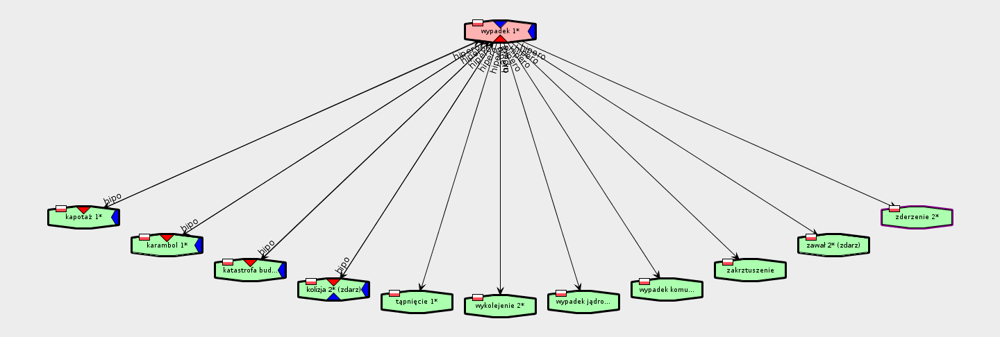
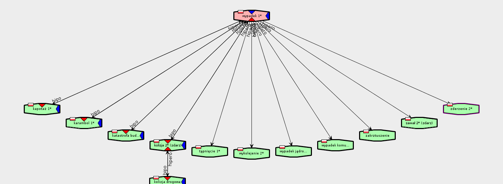
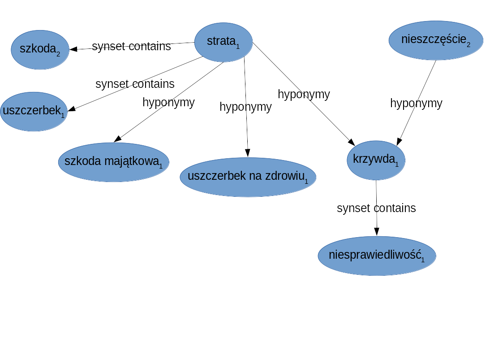

# Answers

* Find all meanings of the *szkoda* **noun** and display all their synonyms. [Found on `http://plwordnet.pwr.wroc.pl/` website]
    * miejsce w polu lub ogrodzie, gdzie zwierzęta (np. drób, bydło) zniszczyły plony
    * mimowolna utrata czegoś, szkoda
        * strata 1
        * utrata 1
        * uszczerbek 1

* Find closure of **hypernymy** relation for the first meaning of the *wypadek drogowy* expression. Create diagram of the relations as a directed graph.

    Diagram generated with `http://plwordnet.pwr.wroc.pl/` website
    

* Find direct **hyponyms** of _wypadek1_ noun.

    Diagram created with [WordNetLoom-Viewer](http://ws.clarin-pl.eu/public/WordnetLoom-Viewer.zip)
    

* Find second-order **hyponyms** of the same noun.

    Only one new lexem - *kolizja drogowa* - was added.
    

* Display as a directed graph (with labels for the edges) semantic relations between the following groups of lexemes:
    1. szkoda2, strata1, uszczerbek1, szkoda majątkowa1, uszczerbek na zdrowiu1, krzywda1, niesprawiedliwość1, nieszczęście2.

        Drawn in *LibreOffice Draw*, based on result of exploration in *WordNetLoom-Viewer*
        