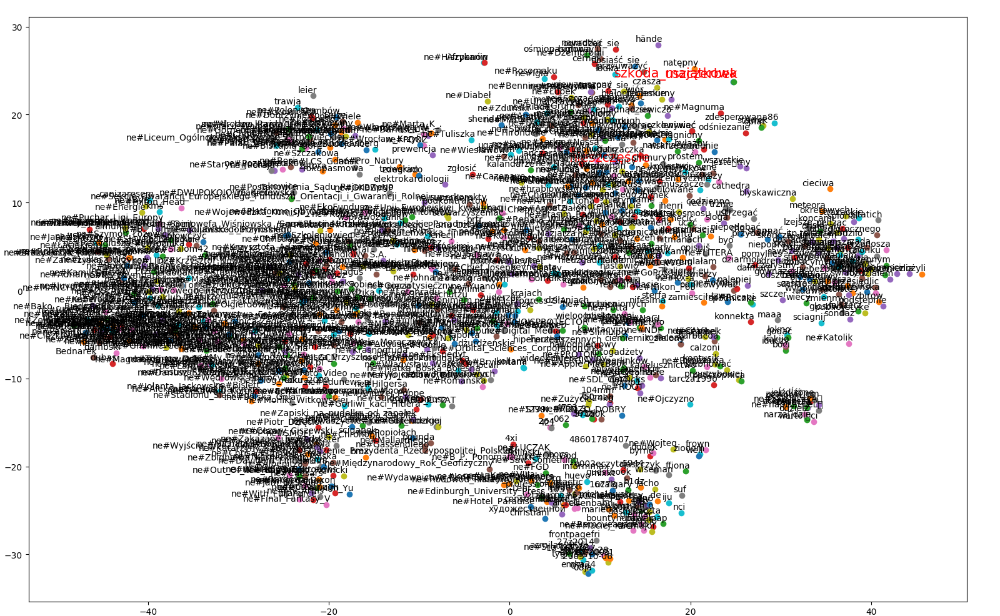
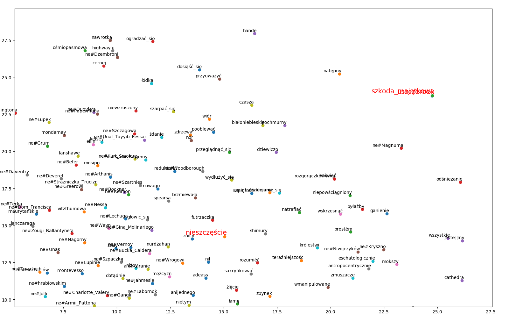

# Results

* The most similar words or expressions for the following expressions:
    * sąd:
        - trybunał: rzeczownik
        - sędzia: rzeczownik
        - sądowy: przymiotnik
        - wyrok: rzeczownik
        - sąd_królewski: rzeczownik
        - ława_przysięgłych: rzeczownik
        - prokurator: rzeczownik
        - sąd_okręgowy: rzeczownik
        - sąd_pierwszej_instancji: rzeczownik
        - ne#Mary_Ryan: rzeczownik
    * trybunał:
        - sąd: rzeczownik
        - sąd_królewski: rzeczownik
        - sąd_kościelny: rzeczownik
        - ne#Trybunał_Kasacyjny: rzeczownik
        - ne#Trybunału: rzeczownik
        - sędzia: rzeczownik
        - ne#Sąd_Kasacyjny: rzeczownik
        - ne#strasburskiego: rzeczownik
        - sąd_apelacyjny: rzeczownik
        - prokurator: rzeczownik
    * kodeks_cywilny:
        - ne#Kodeksu_cywilnego: rzeczownik
        - ne#Kodeks_Cywilny: rzeczownik
        - ne#Kodeksie_cywilnym: rzeczownik
        - ne#Kodeksie_Cywilnym: rzeczownik
        - ne#kodeksu_cywilnego: rzeczownik
        - kodeks_handlowy: rzeczownik
        - kodeks_pracy: rzeczownik
        - ne#Kodeksu_Cywilnego: rzeczownik
        - ne#Kodeksu_postępowania_cywilnego: rzeczownik
        - ne#Kodeks_cywilny: rzeczownik
    * kpk:
        - ne#Kodeksu_postępowania_karnego: rzeczownik
        - kpk: przymiotnik
        - kpc: rzeczownik
        - kk: rzeczownik
        - ppsa: rzeczownik
        - ne#KPC: rzeczownik
        - ne#Kodeksu_postępowania_w_sprawach_o_wykroczenia: rzeczownik
        - ne#Kpa: rzeczownik
        - kpow: rzeczownik
        - 1kpk: przymiotnik
    * szkoda:
        - wyrządzić: czasownik
        - Krzywda: rzeczownik
        - strata: rzeczownik
        - nieszczęście: rzeczownik
        - obawiać_się: czasownik
        - pożytek: rzeczownik
        - żałować: czasownik
        - korzyść: rzeczownik
        - skutek: rzeczownik
        - przypuszczać: czasownik
    * wypadek:
        - przypadek: rzeczownik
        - okoliczność: rzeczownik
        - skutek: rzeczownik
        - sytuacja: rzeczownik
        - zdarzenie: rzeczownik
        - zapewne: partykuła
        - przyczyna: rzeczownik
        - wydarzenie: rzeczownik
        - prawdopodobnie: przysłówek
        - jednakże: partykuła
    * kolizja:
        - kolizja_drogowa: rzeczownik
        - kolizj: rzeczownik
        - wypadek_drogowy: rzeczownik
        - zderzenie: rzeczownik
        - zderzenie_czołowe: rzeczownik
        - kraksa: rzeczownik
        - stłuczka: rzeczownik
        - drogowyc: rzeczownik
        - zdarzać: rzeczownik
        - awaria: rzeczownik
    * szkoda_majątkowa:
        - wyrządzić: rzeczownik
        - damnum: rzeczownik
        - wyrządzo: rzeczownik
        - delikt: rzeczownik
        - zagarnięcie_mienia: rzeczownik
        - uszczupleń: rzeczownik
        - odszkodowawczy: przymiotnik
        - odpowiedzialność_odszkodowawcza: rzeczownik
        - niemajątkowy: przymiotnik
        - emergens: rzeczownik
    * nieszczęście:
        - niebezpieczeństwo: rzeczownik
        - klęska: rzeczownik
        - zguba: rzeczownik
        - zgryzota: rzeczownik
        - Krzywda: rzeczownik
        - strapienie: rzeczownik
        - niedola: rzeczownik
        - los: rzeczownik
        - nieszczęśliwy: przymiotnik
        - utrapienie: rzeczownik
    * rozwód:
        - małżeństwo: rzeczownik
        - rozwodowy: przymiotnik
        - rozwiedziony: przymiotnik
        - rozwieść_się: czasownik
        - rozwieść: czasownik
        - małżeńśtwa: rzeczownik
        - rozwiedzeni: rzeczownik
        - konkubinat: rzeczownik
        - rozwódka: rzeczownik
        - ne#Katarzyną_Aragońską: rzeczownik

* Result of the equations:
    * sąd - kpc + konstytucja
        - sąd: rzeczownik
        - konstytucja: rzeczownik
        - trybunał: rzeczownik
        - parlament: rzeczownik
        - rząd: rzeczownik
    * pasażer - mężczyzna + kobieta
        - pasażer: rzeczownik
        - podróżny: rzeczownik
        - współpasażer: rzeczownik
        - podróżujący: rzeczownik
        - kierowca: rzeczownik
    * samochód - droga + rzeka
        - motorówka: rzeczownik
        - jezioro: rzeczownik
        - Łódź: rzeczownik
        - rzeka: rzeczownik
        - ne#Helensburgha: rzeczownik

* Projection of the random 1000 words using t-SNE algorithm:
    * bird's eye:
        
    * zoom-in on the area with highlighted *szkoda_majątkowa*, *uszczerbek* and *nieszczęście*:
        