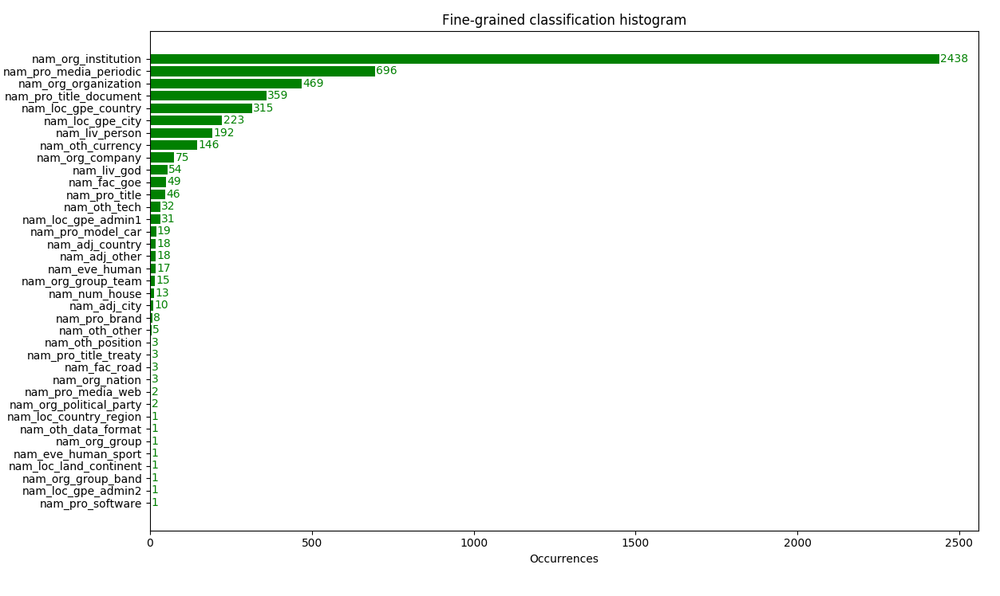
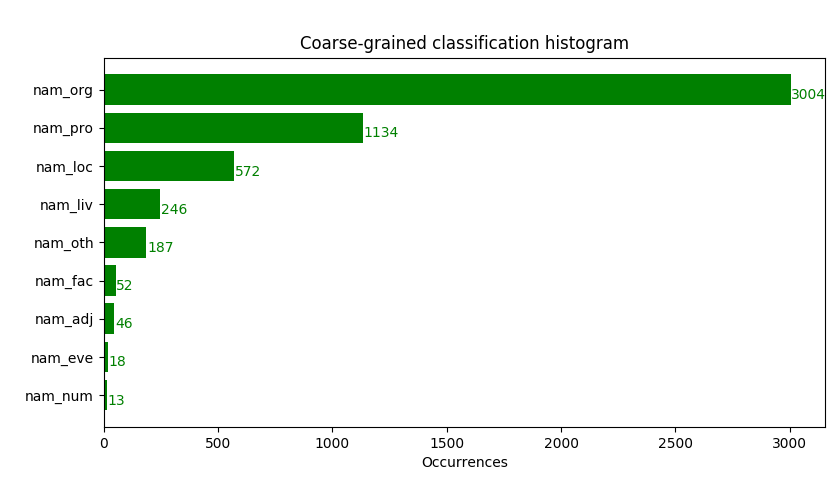

# Results

## Fine-grained classification histogram

## Coarse-grained classification histogram

## 50 most frequent Named Entities including their count and fine-grained type

* Dzieje_(Apostolskie). u.: nam_pro_media_periodic; count: 410
* dziennik. u.: nam_pro_media_periodic; count: 194
* minister sprawiedliwość: nam_org_institution; count: 184
* rzeczpospolita polski: nam_loc_gpe_country; count: 163
* skarb państwo: nam_org_institution; count: 128
* złoty: nam_oth_currency; count: 124
* wysoki izba kontrola: nam_org_institution; count: 81
* agencja: nam_org_institution; count: 77
* bor: nam_org_institution; count: 77
* prezes rad minister: nam_org_institution; count: 68
* EWG: nam_org_organization; count: 64
* prezes wysoki izba kontrola: nam_org_institution; count: 63
* rejestr: nam_loc_gpe_city; count: 62
* w: nam_org_organization; count: 62
* rada minister: nam_org_institution; count: 57
* dziennik. URz: nam_pro_media_periodic; count: 55
* minister obrona narodowy: nam_org_institution; count: 52
* marszałek sejm: nam_org_institution; count: 45
* rzeczpospolita Polska: nam_loc_gpe_country; count: 45
* polski organizacja turystyczny: nam_org_institution; count: 44
* unia europejski: nam_org_organization; count: 41
* Polska: nam_loc_gpe_country; count: 39
* sejm: nam_org_institution; count: 39
* senat: nam_org_institution; count: 39
* pan: nam_liv_god; count: 39
* urząd ochrona państwo: nam_org_institution; count: 38
* sąd najwyższy: nam_org_institution; count: 34
* krajowy rejestr sądowy: nam_org_institution; count: 32
* służba cywilny: nam_org_institution; count: 28
* fundusz ubezpieczenie społeczny: nam_org_institution; count: 27
* biuro ochrona rząd: nam_org_institution; count: 27
* dziennik urzędowy: nam_pro_media_periodic; count: 26
* prezes urząd: nam_org_institution; count: 26
* warszawa: nam_loc_gpe_city; count: 25
* prezydent rzeczpospolita polski: nam_org_institution; count: 25
* minister finanse: nam_org_institution; count: 24
* krajowy rejestr sądowy: nam_fac_goe; count: 24
* parlament europejski: nam_org_institution; count: 24
* kościół: nam_org_organization; count: 23
* monitor Polska: nam_pro_title; count: 23
* służba więzienny: nam_org_institution; count: 22
* krajowy rad sądownictwo: nam_org_institution; count: 22
* dziennik urzędowy rzeczpospolita polski ": nam_org_institution; count: 21
* rad minister: nam_org_institution; count: 20
* państwowy straża pożarny: nam_org_organization; count: 20
* siła zbrojny: nam_org_institution; count: 19
* zakład ubezpieczenie społeczny: nam_org_institution; count: 18
* wyrób medyczny: nam_liv_person; count: 17
* trybunał konstytucyjny: nam_org_institution; count: 16
* krajowy rada sądownictwo: nam_org_institution; count: 16

## 10 most frequent Named Entities for each coarse-grained type

* `nam_pro` - *chrematonyms (human's creations)*:
    - Dzieje_(Apostolskie). u.: 410
    - dziennik. u.: 194
    - dziennik. URz: 55
    - dziennik urzędowy: 26
    - monitor Polska: 23
    - kodeks postępowanie cywilny: 15
    - ordynacja podatkowy: 13
    - kodeks karny: 11
    - kodeks postępowanie administracyjny: 10
    - ustawa z dzień 26 lipiec 1991 r. o podatek dochodowy od osoba fizyczny: 9
* `nam_org` - *organization, institutions, teams, organised groups etc.*:
    - minister sprawiedliwość: 184
    - skarb państwo: 128
    - wysoki izba kontrola: 81
    - agencja: 77
    - bor: 77
    - prezes rad minister: 68
    - EWG: 64
    - prezes wysoki izba kontrola: 63
    - w: 62
    - rada minister: 57
* `nam_loc` - *toponymies (localizations, geopolitical and geographical units)*:
    - rzeczpospolita polski: 163
    - rejestr: 62
    - rzeczpospolita Polska: 45
    - Polska: 39
    - warszawa: 25
    - bielski - Biała: 10
    - Szczecin: 7
    - Świnoujście: 6
    - rad: 5
    - Gdynia: 5
* `nam_oth` - *names of technologies, currencies, e-mail addresses, webpages etc.*:
    - złoty: 124
    - euro: 15
    - bor: 9
    - PESEL: 8
    - ecu: 7
    - `+ - - - - - + - - - - - + - - - - - - + - - - - - + - - - - - - + - - - - - -`: 5
    - minister edukacja narodowy: 3
    - NIP: 3
    - `4. 1.`: 3
    - V: 2
* `nam_liv` - *living beings (people, characters, animals)*:
    - pan: 39
    - wyrób medyczny: 17
    - sekunda T a w a: 13
    - wpływ: 10
    - bóg: 9
    - marek Kuchciński: 9
    - kart nauczyciel: 8
    - siła zbrojny: 7
    - zysk: 7
    - XVI: 6
* `nam_fac` - *constructions (buildings, monuments) built by people*:
    - krajowy rejestr sądowy: 24
    - straża graniczny: 5
    - krajowy rejestr karny: 5
    - Porta Gdynia holding SA: 3
    - straża park: 3
    - X: 2
    - krajowy rad sądownictwo: 2
    - bor: 2
    - parafia Bydgoszcz parafia Chełm parafia dąbrówka parafia dług kąt parafia: 1
    - marszałek senat: 1
* `nam_adj` - *adjectives derived of proper nouns*:
    - europejski: 15
    - polski: 14
    - małopolski: 2
    - mazowiecki: 2
    - łódzki: 2
    - macierzyński: 1
    - warmińskomazurski: 1
    - opolski: 1
    - niemiecki: 1
    - dolnośląski: 1
* `nam_num` - *numeric expressions*:
    - 1: 13
* `nam_eve` - *events organized or scheduled by people and natural disasters*:
    - krajowy rejestr sądowy: 5
    - VAT RR: 2
    - dobry praktyka dystrybucyjny: 2
    - monitor sądowy: 1
    - NIP ubezpieczony: 1
    - top SECRET: 1
    - narodowy spis powszechny ludność i mieszkanie 2001 R: 1
    - narodowy spis powszechny ludność i mieszkanie 2002 R: 1
    - narodowy bank Polska: 1
    - międzynarodowy standard rachunkowość: 1

## Discussion

A vast majority of named entities found in the bills are names of organizations and roles. Next category - human's creations - in majority consist of repetitions of *Dziennik Ustaw*.

There is very small amount of detected event names, most represented names in this category are wrongly associated.

Definitely most of the detected words are connected with the law.